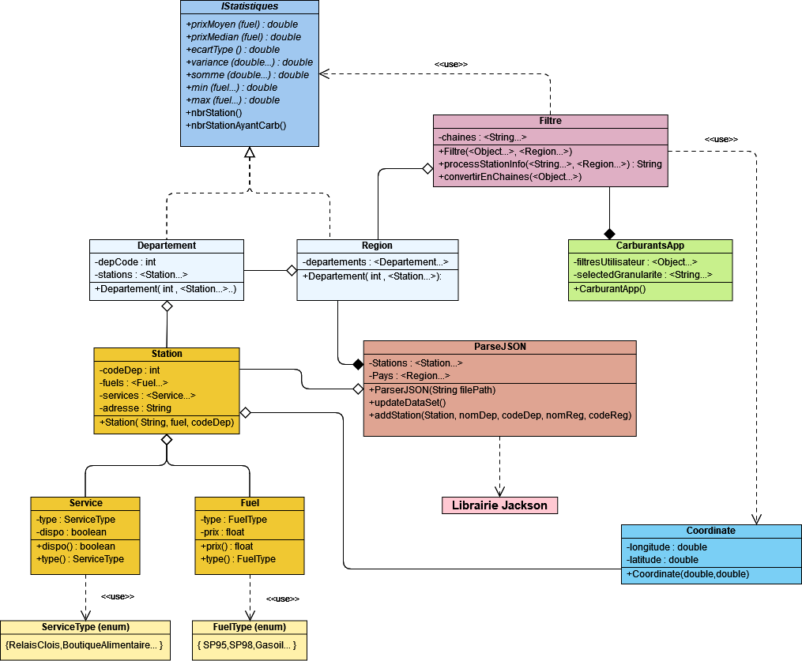

**Membres du projet :**

 - Evan RIO : evan.rio@etudiant.univ-rennes1.fr
 - Aidan OGER : aidan.oger@etudiant.univ-rennes1.fr
 - Ethan OREAC : ethan.oreac@etudiant.univ-rennes1.fr
 - Pierre ROUMANE : pierre.roumane@etudiant.univ-rennes1.fr
 - Rabah RAHOU : rabah.rahou@etudiant.univ-rennes1.fr
 - Mathis ROUX : mathis.roux@etudiant.univ-rennes1.fr
 - Maxime VION : maxime.vion@etudiant.univ-rennes1.fr

# Dépendances :
- Java 17 *ou plus récent*
- Jackson 2.0.0

# Lancement du jar si besoin : 
java --enable-preview -jar L2GEN_G3_Vert_Scrum.jar

# Diagramme UML

**User Stories :**

**Sélection de Granularité**
- En tant que client/utilisateur je dois pouvoir choisir entre deux granularités principales (département ou région) afin de pouvoir réduire mes recherches.

- Prioritaire

- Nombre de points:  2

- Étant donné mon choix de départements/régions, quand je “clique” sur une région ou un département je suis censé être rediriger vers les stations présentes dans ces régions/départements

**Sélection de Types de Carburants**
- En tant que client/utilisateur je dois pouvoir sélectionner un ou plusieurs types de carburant parmi ceux disponibles dans les données conformes au schéma JSON fourni. L’application doit optionnellement donner, pour chaque type de carburant sélectionné, l’adresse du moins cher dans chaque département ou région (selon granularité choisie). 

- Prioritaire

- Nombre de points: 2

- Étant donné mon choix de carburant, je suis censé avoir comme recommandations les carburants les moins chers de la région/département où je me trouve.

**Sélection de Statistiques**
- En tant qu’utilisateur, je souhaite pouvoir avoir des statistiques à propos des carburants autour de moi (Médiane, Moyenne, Minimum)

- Prioritaire

- Nombres de points : 1
    -Moyenne
    -Médiane
    -Minimum

- Conditions d’acceptations : Si on peut calculer les différentes points pour un type d’essence donné alors le point est validé

**Génération de Rapports**

- En tant qu’utilisateur je souhaite pouvoir afficher les résultats de mes requêtes dans un rapport sous forme de page Web.

- Pas prioritaire : en dernier

- Nombre de points : 3

- Conditions d’acceptation : Etant donné que j’ai utilisé des options de l’application spécifiées plus haut, quand je clique sur “Générer Rapport”, alors j’arrive sur une page Web contenant les informations concernant toutes les options choisies de manière concise et lisible.